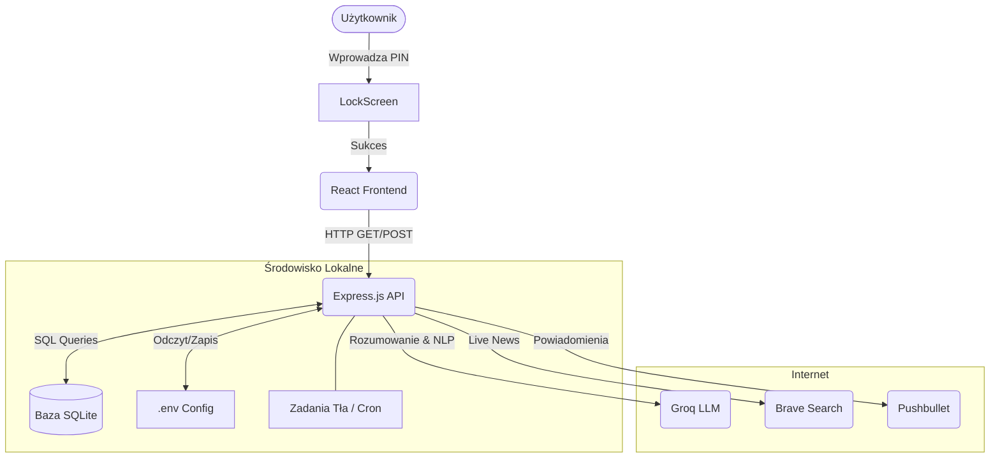

<div align="center">
  
# 🌌 OmniDash
### Twój Osobisty Hub Dowodzenia Napędzany Sztuczną Inteligencją


*Przełam rutynę. Zarządzaj swoimi dniami za pomocą wbudowanego, obiektywnego analityka i superszybkiego interfejsu.*

</div>

---

## 📖 O Projekcie

**OmniDash** to kompleksowe, lokalne środowisko zarządzania (Local-First), które integruje w sobie zaawansowanego asystenta opartego na architekturze LLM (Groq / LLaMa 3). Projekt został stworzony w paradygmacie *Desktop-First*, z myślą o najwyższej wydajności, pełnej prywatności i bezprecedensowej ergonomii.

Nie jest to kolejny zwykły czat. Asystent posiada funkcję **Tool Calling** – potrafi samodzielnie wywoływać metody systemowe: modyfikować bazę danych, analizować statystyki CPU/RAM komputera i wyszukiwać najświeższe newsy ze świata bezpośrednio z sieci.

---

## ✨ Kluczowe Funkcje

### 🧠 Rdzeń Oparty na AI
- **LLM as the Core Engine**: Odpowiedzi, planowanie i dedukcja są przetwarzane w locie przez superwydajne modele (np. Llama-3.3-70b-versatile).
- **Tryby Pracy (Worker / Mentor)**: 
  - *Worker*: Operacyjny asystent, który realizuje Twoje polecenia.
  - *Mentor*: Tryb czysto analityczny. Obserwuje Twoje tok myślenia, pozbawiony możliwości modyfikacji systemu, zapewniając surową ocenę pomysłów.
- **Autonomiczne Narzędzia**: AI potrafi dodawać/usuwać/edytować Twoje zadania bez sztywnych komend, tylko za sprawą języka naturalnego (NLP).

### ⚡ Funkcje Operacyjne
- **Zarządzanie Zadaniami (To-Do)**: Wbudowana, w pełni interaktywna lista zadań z priorytetami, kalendarzem i widokiem kaskadowym.
- **Background Scheduler**: Proces tła (cron-like), który może odpalać automatyczne skrypty co godzinę – np. wysyłać powiadomienia, czy sprawdzać pogodę.
- **Wbudowane Widżety Premium**:
  - 🗞️ **Live News Ticker**: Aktualności ze świata IT pobierane w czasie rzeczywistym z podziałem na kategorie (White Hat, Jailbreak, Open Source).
  - 📈 **Crypto Tracker**: Śledzenie rynków kryptowalut w czasie rzeczywistym z wykorzystaniem API Binance.
  - ⛅ **Monitor Pogodowy**: Integracja z Open-Meteo oferująca precyzyjne 3-godzinne prognozy.
  - 🖥️ **System Monitor**: Odczyt na żywo wykorzystania procesora, pamięci operacyjnej i Uptime'u.

### 🎨 Design i Użyteczność
- **Aesthetic Glassmorphism**: Zaprojektowany z miłością do piękna kodowania. Rozmycia, mroczne warianty kolorystyczne, neo-brutalizm w typografii.
- **Dynamiczna Inicjalizacja**: Przy pierwszym uruchomieniu zostaniesz powitany instalatorem premium. Wprowadzasz klucze, wymyślasz własny PIN główny, a system szyfruje to w sekundę.
- **Ghost Mode**: Tryb w pełni incognito, nie zostawiający żadnego śladu w historii bazy (lokalne sesje projektowe).

---

## 🛠️ Stack Technologiczny

Aplikacja podzielona jest na dwa wysoce zoptymalizowane środowiska:

### Frontend
- **React 18** z architekturą komponentową i **React Router**.
- **Tailwind CSS 3** do budowania systemu designu.
- **Vite** jako błyskawiczny bundler.
- **Lucide React** (ikonografia).
- **React Markdown** (renderowanie bogatego tekstu od AI).

### Backend
- **Node.js + Express**: Szybki, asynchroniczny API Gateway.
- **SQLite3**: Plikowa i wysoce przenośna baza danych. Nie wymaga skomplikowanego stawiania kontenerów Docker.
- **Groq SDK**: Bezpośrednia i niskolatencyjna komunikacja z klastrami obliczeniowymi modeli AI.
- **WebSockets**: Do asynchronicznej komunikacji z telefonem (Pushbullet).

---

## 🚀 Instalacja i Uruchomienie (Krok po Kroku)

Dzięki architekturze plikowej (SQLite), projekt jest gotowy do działania w kilka minut. Poniżej znajdziesz instrukcje uruchomienia lokalnego (Desktop) oraz wdrożenia na serwer.

### Opcja A: Uruchomienie Lokalne (Desktop - Windows/Mac/Linux)

**1. Wymagania**
Upewnij się, że masz zainstalowany **Node.js** (min. `18.0.0`) oraz **Git**.
- **Windows:** `winget install OpenJS.NodeJS` oraz `winget install Git.Git`
- **Mac:** `brew install node git`
- **Linux:** `sudo apt update && sudo apt install nodejs npm git`

**2. Pobranie i instalacja**
```bash
git clone https://github.com/Kvbi213/ai-system-dashboard.git
cd ai-system-dashboard
npm install
```

**3. Uruchomienie**
- **Windows:** Dwuklik na `start.bat`
- **Mac/Linux:** Wpisz `npm run start` w konsoli.
Następnie wejdź na `http://localhost:5173`.

---

### Opcja B: Wdrożenie na Serwerze (Produkcja 24/7)

Aby OmniDash działał bez przerw w tle, zalecane jest użycie menedżera procesów **PM2** oraz opcjonalnie serwera Reverse Proxy (np. Nginx).

#### 🐧 Debian / Ubuntu Linux Server

**1. Instalacja środowiska i PM2**
```bash
curl -fsSL https://deb.nodesource.com/setup_20.x | sudo -E bash -
sudo apt install -y nodejs git
sudo npm install -g pm2
```

**2. Pobranie aplikacji**
```bash
cd /opt
sudo git clone https://github.com/Kvbi213/ai-system-dashboard.git
cd ai-system-dashboard
sudo npm install
```

**3. Uruchomienie w tle i autostart**
```bash
sudo pm2 start npm --name "omnidash" -- run start
sudo pm2 save
sudo pm2 startup
```

*(Opcjonalnie)* Jeśli chcesz udostępnić dashboard pod konkretnym portem (np. 80), zainstaluj Nginx (`sudo apt install nginx`) i ustaw blok `proxy_pass http://localhost:5173;`.

#### 🪟 Windows Server

**1. Instalacja środowiska**
Zainstaluj [Node.js](https://nodejs.org/) oraz [Git dla Windows](https://git-scm.com/download/win). Uruchom PowerShell jako Administrator i wpisz:
```powershell
npm install -g pm2
npm install -g pm2-windows-startup
pm2-startup install
```

**2. Pobranie i start aplikacji**
Pobierz repozytorium do wybranego folderu (np. `C:\OmniDash`), wejdź tam w terminalu i wpisz:
```powershell
npm install
pm2 start npm --name "omnidash" -- run start
pm2 save
```
Aplikacja będzie teraz działać w tle jako usługa systemu Windows, automatycznie wznawiając pracę po restarcie maszyny.

---

### 🔑 Inicjalizacja (Pierwsze kroki - Dotyczy wszystkich środowisk)
Przejdź w przeglądarce pod adres IP swojego serwera (lub `http://localhost:5173` lokalnie).
1. System wykryje świeżą instalację i uruchomi **Ekran Inicjalizacji**.
2. Wprowadź wymagane klucze API:
   - *Groq API Key* (silnik AI)
   - *Brave Search API Key* (wyszukiwarka)
   - *Pushbullet API Key* (powiadomienia)
3. Zdefiniuj swój unikalny **Kod PIN**, który będzie chronił Twój Dashboard przed niepowołanym dostępem.
4. Zapisz. System się zresetuje i odda Ci pełną kontrolę!

---

## 🛡️ Bezpieczeństwo Danych i Prywatność

Projekt został stworzony dla osób ceniących własną prywatność operacyjną:

* **Brak Zewnętrznych Baz Danych**: 100% twoich logów, zadań To-Do oraz notatek rezyduje wyłącznie na twoim fizycznym dysku twardym w pliku `data/tasks.sqlite`.
* **Szyfrowanie API**: Klucze wpisane podczas inicjalizacji lądują w wyizolowanym pliku `.env` na backendzie. Nie mają do nich dostępu żadne skrypty frontendowe z poziomu przeglądarki.
* **Factory Reset**: Aplikacja posiada w zakładce Ustawienia przycisk "Factory Reset" służący do bezpiecznego, awaryjnego zerowania bazy danych oraz usuwania pliku z kluczami, jeżeli chcesz całkowicie usunąć swój ślad z programu.

---

## 🗺️ Architektura Systemu (Diagram)

Poniżej znajduje się uproszczony diagram przepływu informacji między modułami:



---

## 🤝 Kontrybucja

Wszelkie usprawnienia (Pull Requesty), zgłoszenia błędów (Issues) i sugestie nowych modułów widżetów są wysoce pożądane!
1. Wykonaj Fork repozytorium.
2. Stwórz nową gałąź dla funkcji (`git checkout -b feature/SuperWidzet`).
3. Zacommituj zmiany (`git commit -m 'Dodano Super Widżet'`).
4. Wypchnij gałąź (`git push origin feature/SuperWidzet`).
5. Otwórz Pull Request.

---

## 📝 Licencja

Ten projekt jest chroniony licencją **MIT**. Masz pełne prawo do modyfikacji i używania go do własnych potrzeb komercyjnych jak i prywatnych.

<div align="center">
  <sub>Stworzone z pasją do automatyzacji i estetyki oprogramowania.</sub>
</div>
