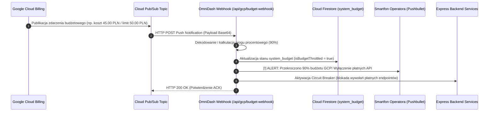

<div align="center">
  
# OmniDash AI System Dashboard
### Zaawansowany Hybrydowy Hub Dowodzenia i Analityki Osobistej

[](https://github.com/Kvbi213/ai-system-dashboard)
[](https://github.com/Kvbi213/ai-system-dashboard/actions)
[](https://github.com/Kvbi213/ai-system-dashboard)
[](#)
[](https://void-potato-7721.web.app)
[](#)
[](https://nodejs.org/)
[](LICENSE)

*Zunifikowany, wysoce zoptymalizowany ekosystem zarządzania osobistego, analityki operacyjnej i telemetrycznej z autonomicznym agentem AI, architekturą Cloud-First, pełną synchronizacją Firestore, automatycznym bezpiecznikiem budżetowym Google Cloud, wywiadem drogowym CANARD i natywnym kotwiczeniem czasowym Europe/Warsaw.*

**[Dokumentacja Architektury](ARCHITECTURE.md)** • **[Rejestr Wdań i Zmian](HISTORY.md)** • **[Zasady Pracy](ZASADYPRACY.md)**

</div>

---

## Podgląd Interfejsu Konsoli Dowodzenia

```
+-------------------------------------------------------------------------------------------------------+
| OmniDash AI Command Hub  [Szukaj Ctrl+K]  [/ Motyw]  [Warszawa 14:32]  [GCP: 0.00 PLN]  [● ONLINE]   |
+----------------+--------------------------------------------------------------------------------------+
| Pulpit         | +----------------------+ +----------------------+ +--------------------------------+ |
| [AI] Agent     | | ● SSE LIVE STREAM    | | Open-Meteo Weather   | | Wiadomości IT & Bezpieczeństwo | |
| Plan Lekcji    | | CPU: 14%  RAM: 38%   | | 21°C Słonecznie      | | [AI] GPT-120B reasoning update | |
| Finanse        | | Heap: 34MB Up: 6h    | | Wiatr: 12 km/h       | | [Sec] Zero Trust Firestore v2  | |
| Droga & Radary | +----------------------+ +----------------------+ +--------------------------------+ |
| Kalendarz      | +--------------------------------------------------+ +-----------------------------+ |
| [BRAIN] Pamięć | | Budżet Kopertowy 50 / 30 / 20 & GCP Guard        | | Lista Zadań Priorytetowych  | |
| Edukacja       | | Potrzeby: 50% | Zachcianki: 30% | Oszczędn.: 20% | | [x] Audyt Zero-Trust CORS   | |
| OSINT Hub      | | Bilans: +1 850 PLN  [Eksport CSV] [Drukuj PDF]   | | [ ] Weryfikacja webhooka GCP| |
| Terminal       | +--------------------------------------------------+ +-----------------------------+ |
| ────────────── | +----------------------------------------------------------------------------------+ |
| Ustawienia     | | [AI] Autonomiczny Agent AI (Worker / Mentor) - Temporal Anchoring Europe/Warsaw  | |
| Tryb Ciemny    | | Status: Aktywny | Narzędzia: Baza, Pogoda, Fotoradary, Librus, Budżet, Pamięć   | |
+----------------+------------------------------------------------------------------------------------+--+
```

---

## Spis Treści
1. [Wprowadzenie i Filozofia Architektury](#-wprowadzenie-i-filozofia-architektury)
2. [Topologia Hybrydowa i Diagramy Przepływu](#-topologia-hybrydowa-i-diagramy-przepływu)
3. [Główne Podsystemy i Funkcjonalności](#-główne-podsystemy-i-funkcjonalności)
4. [Tarcza Bezpieczeństwa Zero-Trust (Hardening v2.28.0)](#-tarcza-bezpieczeństwa-zero-trust)
5. [Bezpiecznik Budżetowy Google Cloud (Budget Guard)](#-bezpiecznik-budżetowy-google-cloud-budget-guard)
6. [Wywiad Drogowy i Geolokalizacja (CANARD / Janosik)](#-wywiad-drogowy-i-geolokalizacja-canard--janosik)
7. [Silnik Kognitywny Agenta AI i Zarządzanie Pamięcią](#-silnik-kognitywny-agenta-ai-i-zarządzanie-pamięcią)
8. [System Finansowy 50/30/20 & Eksport Raportów](#-system-finansowy-503020--eksport-raportów)
9. [Automatyczne Testy Jednostkowe i Integracyjne (197/197)](#-automatyczne-testy-jednostkowe-i-integracyjne)
10. [Konfiguracja Środowiska i Zmienne (.env.example)](#-konfiguracja-środowiska-i-zmienne)
11. [Instalacja i Uruchomienie](#-instalacja-i-uruchomienie)
12. [Potok CI/CD i Jakość Kodu](#-potok-cicd-i-jakość-kodu)
13. [Licencja](#-licencja)

---

## Wprowadzenie i Filozofia Architektury

**OmniDash** to platforma klasy **Personal Command Hub & AI Operations Center**, łącząca bezkompromisową szybkość interfejsu Single Page Application z architekturą rozproszoną chmury (**Cloud-First Hybrid Mesh**).

Głównym założeniem projektu jest całkowita eliminacja rozproszenia narzędzi w codziennym funkcjonowaniu operatora. Zamiast kilkunastu odrębnych portali i aplikacji, OmniDash dostarcza **zintegrowany pulpit operacyjny**, w którym:
- **Autonomiczny Agent AI** wykonuje operacje na danych użytkownika za pomocą ustrukturyzowanych wywołań narzędziowych (**Tool Calling**).
- **Zasada Zero-Cost Shield** uniemożliwia generowanie jakichkolwiek kosztów chmurowych dzięki twardym limitom, bezpiecznikom Pub/Sub oraz fallbackom do darmowych silników (Edge Neural TTS, Open-Meteo, OSRM).
- **Model Bezpieczeństwa Zero-Trust** chroni bazę Firestore, routery API Express i poświadczenia systemowe przed nieautoryzowanym dostępem.

---

## Topologia Hybrydowa i Diagramy Przepływu

### 1. Hybrydowa Topologia Systemu (Cloud-First Hybrid Mesh)


```mermaid
graph TB
    subgraph Klient ["Warstwa Klienta (SPA & Mobile PWA)"]
        UI["React 18 + Tailwind CSS + Lucide Icons"]
        Router["React Router v7"]
        ToastHub["Toast Notification Engine & Offline Guard"]
        ExportHub["Silnik Raportowania CSV / PDF"]
        ThemeEngine["Theme Switcher (7 Palet + Dark/Light)"]
    end

    subgraph Chmura_Google ["Ekosystem Google Cloud & Firebase"]
        FBHost["Firebase Hosting (void-potato-7721.web.app)"]
        Firestore["Google Cloud Firestore (Baza Czasu Rzeczywistego)"]
        PubSub["Google Cloud Pub/Sub (Topic: budget-auto-stop)"]
        BudgetAlert["Cloud Billing Budget Guard (Limit 50 PLN / 0 PLN)"]
    end

    subgraph Backend_Lokalny ["Lokalny Węzeł Dowodzenia (Express :5000)"]
        Server["Express Core Server (core.server.js)"]
        AuthMid["authMiddleware (Zero-Trust + x-system-pin)"]
        SSEStream["Server-Sent Events Telemetria (/api/system/stream)"]
        SQLite["Lokalna Baza Relacyjna SQLite3"]
        WebhookHandler["GCP Budget Webhook (/api/gcp/budget-webhook)"]
    end

    subgraph Integracje_Zewnętrzne ["Zewnętrzne API i Silniki AI"]
        GroqCloud["Groq Cloud LPU (GPT-OSS-120B / Llama 3.3)"]
        ElevenLabs["ElevenLabs Neural Voice (Quota Guard)"]
        EdgeTTS["Edge Neural TTS (Zero-Cost Fallback)"]
        Pushbullet["Pushbullet API (Dual-Channel Push Alert)"]
        Librus["Librus Synergia API (Edu-Hub)"]
        CANARD["CANARD / GITD & GDDKiA (Road Intelligence)"]
    end

    UI --> Router
    Router --> ToastHub
    Router --> ExportHub
    UI --> ThemeEngine
    FBHost -.->|Serwowanie Aplikacji| UI
    UI <-->|Migawki Czasu Rzeczywistego onSnapshot| Firestore
    UI <-->|REST API + x-system-pin| Server
    UI <-->|Strumień Telemetrii SSE| SSEStream
    Server --> AuthMid
    AuthMid --> WebhookHandler
    BudgetAlert --> PubSub
    PubSub -->|Push HTTP POST| WebhookHandler
    Server --> SQLite
    Server --> GroqCloud
    Server --> ElevenLabs
    Server --> EdgeTTS
    Server --> Pushbullet
    Server --> Librus
    Server --> CANARD
```

---

## Główne Podsystemy i Funkcjonalności

| Podsystem | Ścieżka / Moduł | Opis Inżynieryjny |
| :--- | :--- | :--- |
| **Pulpit Główny** | `/` | Monitor parametrów CPU/RAM/V8 przez SSE, widget pogodowy Open-Meteo, pasek wiadomości IT, szybkie karty statusu. |
| **Autonomiczny Agent AI** | `/chat` | Dwa tryby pracy: **Worker** (prawa mutacji bazy danych, terminarza i finansów) oraz **Mentor** (analityk kognitywny). Pętla fallbacku modeli LLM. |
| **Google Cloud Budget Guard** | `/settings` • `/api/gcp/*` | Dwuwarstwowy bezpiecznik budżetowy GCP: subskrypcja Push Pub/Sub, automatyczne odcinanie płatnych API (Circuit Breaker) i powiadomienia na telefon. |
| **Wywiad Drogowy (Road Intel)** | `/traffic` | Wyszukiwanie fotoradarów CANARD/GITD i odcinkowych pomiarów prędkości (OPP) na trasie, alerty drogowe GDDKiA, wyliczanie odległości GPS. |
| **Hub Edukacyjny Librus** | `/timetable` • `/grades` | Integracja z Librus Synergia: oceny ze średnimi ważonymi, terminarz sprawdzianów, szczęśliwy numerek, plan lekcji z korelacja sal. |
| **Budżet Kopertowy 50/30/20** | `/finances` | Matematyczny model alokacji środków, transfery między kopertami, dynamiczne wykresy SVG, raporty CSV i wydruki PDF. |
| **Smartfon jako Terminal** | `/api/phone/*` | Dwukierunkowa integracja Pushbullet: dodawanie wydatków z telefonu, autoodpowiedzi asystenta AI OmniDaemon w czasie rzeczywistym. |
| **Odporna Synteza Mowy** | `/api/voice/*` | Inspekcja limitów ElevenLabs, licznik bezpłatnego pułapu (1,000,000 znaków), płynny fallback do Edge Neural TTS i Web Speech API. |
| **Baza Faktów i Pamięć AI** | `/memory` | Trwały magazyn wiedzy o operatorze (`operator_brain`) z kategoryzacją i automatycznym zasilaniem promptu systemowego. |
| **Wywiad OSINT** | `/osint` | Rozpoznanie celów sieciowych: klasyfikacja IPv4/IPv6, WHOIS, domeny, adresy MAC, wycieki HIBP i archiwum Wayback Machine. |
| **Dziennik Treningowy** | `/workouts` | Dziennik aktywności fizycznej z podziałem na serie, powtórzenia i wykresy objętości treningowej. |
| **Terminal Systemowy** | `/server` | Narzędzie diagnostyczne, weryfikacja kluczy API, zarządzanie procesami i inspekcja integralności bazy danych. |

---

## Tarcza Bezpieczeństwa Zero-Trust

W wersji **v2.28.0** wdrożono rygorystyczny audyt bezpieczeństwa eliminujący wektory ataków przed ekspozycją na serwerze produkcyjnym:

1. **Zero-Trust Firestore Security Rules**:
   - Usunięto podatność obejścia autoryzacji opartą o `keys().size() > 0`.
   - Każde żądanie odczytu i zapisu do kolekcji bazodanowych (`tasks`, `finances`, `workouts`, `calendar`, `operator_brain`, `chat_history`, `timetable`, `notes`, `system_logs`) bezwzględnie wymaga `request.auth != null`.
   - Kolekcje wrażliwe (`system_budget`, `settings/librus_credentials`) zabezpieczono regułą `isOwner()`, dopuszczającą wyłącznie zweryfikowanego właściciela.
   - Wszystkie pozostałe ścieżki w bazie są domyślnie zablokowane.
2. **CORS Hardening**:
   - Wyeliminowano maski wieloznaczne `*.web.app` i `*.firebaseapp.com`.
   - Dozwolone są wyłącznie precyzyjne domeny produkcyjne (`void-potato-7721.web.app`, `void-potato-7721.firebaseapp.com`), lokalne porty deweloperskie oraz jawna lista zdefiniowana w zmiennej środowiskowej `ALLOWED_ORIGINS`.
3. **Weryfikacja Poświadczeń Wewnętrznych (`x-system-pin`)**:
   - Bezpieczny nagłówek `x-system-pin` umożliwia komunikację mikroserwisów i skryptów automatyzacji bez wymogu generowania sesji interfejsu graficznego.
   - Endpoint `/api/gcp/budget-webhook` posiada bezpieczne wyłączenie spod weryfikacji tokenowej, umożliwiając bezpośredni odbiór komunikatów Pub/Sub Push z infrastruktury Google Cloud.
4. **Tarcza Plików i Sekretów Agenta AI (`readProjectFile`)**:
   - Asystent AI posiada bezwzględną blokadę odczytu plików środowiskowych (`.env`, `.env.*`), certyfikatów i kluczy serwisowych (`firebase-service-account.json`).
   - Wbudowane zabezpieczenie uniemożliwia ataki typu Directory Traversal (`../`).

---

## Bezpiecznik Budżetowy Google Cloud (Budget Guard)

OmniDash realizuje twardą politykę **Zero-Cost Shield**:


```mermaid
sequenceDiagram
    autonumber
    participant GCP as Google Cloud Billing
    participant PubSub as Cloud Pub/Sub Topic
    participant Webhook as OmniDash Webhook (/api/gcp/budget-webhook)
    participant Firestore as Cloud Firestore (system_budget)
    participant Pushbullet as Smartfon Operatora (Pushbullet)
    participant Core as Express Backend Services

    GCP->>PubSub: Publikacja zdarzenia budżetowego (np. koszt 45.00 PLN / limit 50.00 PLN)
    PubSub->>Webhook: HTTP POST Push Notification (Payload Base64)
    Webhook->>Webhook: Dekodowanie i kalkulacja progu procentowego (90%)
    Webhook->>Firestore: Aktualizacja stanu system_budget (isBudgetThrottled = true)
    Webhook->>Pushbullet: [!] ALERT: Przekroczono 90% budżetu GCP! Wyłączenie płatnych API
    Webhook->>Core: Aktywacja Circuit Breaker (blokada wywołań płatnych endpointów)
    Webhook-->>PubSub: HTTP 200 OK (Potwierdzenie ACK)
```

- **Progi Alertowe:** 50%, 90% oraz 100% zdefiniowanego budżetu.
- **Circuit Breaker:** W przypadku osiągnięcia progu 100% (lub 0.00 PLN w trybie darmowym), system automatycznie wstrzymuje wszelkie zapytania do płatnych API Google Cloud i przełącza się na lokalne / bezpłatne zamienniki.

---

## Wywiad Drogowy i Geolokalizacja (CANARD / Janosik)

Wbudowany moduł drogowy (`modules/services/trafficService.js`):
- **Baza Fotoradarów i OPP:** Pełny rejestr stacjonarnych fotoradarów CANARD/GITD oraz Odcinkowych Pomiarów Prędkości w Polsce.
- **Analiza Trasy:** Wyszukiwanie punktów kontroli prędkości w zadanym korytarzu kilometrowym (np. na trasie Gdańsk - Warszawa).
- **Alerty GDDKiA:** Bieżący monitoring utrudnień, wypadków i prac drogowych w promieniu 10-50 km od lokalizacji pojazdu.
- **Wysoka Dokładność GPS:** Frontend wykorzystuje geolokalizację z flagą `enableHighAccuracy: true`, z automatycznym buforem ostatniej znanej pozycji.

---

## Silnik Kognitywny Agenta AI i Zarządzanie Pamięcią

### Pętla Narzędziowa (Autonomous Tool Calling)
Agent AI operuje w oparciu o zestaw narzędzi zdefiniowanych w `modules/ai/tools.js`:
- `executeWebSearch`: przeszukiwanie internetu w czasie rzeczywistym przez silnik Brave Search.
- `ADD_TO_DO` / `UPDATE_TO_DO` / `DELETE_TO_DO`: mutowanie rejestru zadań z obsługą potwierdzenia intencji (`confirmed: true` przy masowym usuwaniu).
- `ADD_FINANCE_RECORD` / `TRANSFER_FUNDS` / `DELETE_FINANCE_RECORD`: rejestracja transakcji, transfery między koszykami 50/30/20 z walidacją wejścia i audytem w `system_logs`.
- `ADD_CALENDAR_EVENT` / `UPDATE_CALENDAR_EVENT` / `DELETE_CALENDAR_EVENT`: zarządzanie kalendarzem.
- `GET_LIBRUS_GRADES` / `GET_LIBRUS_CALENDAR`: odczyt danych edukacyjnych w trybie read-only.
- `GET_SPEED_CAMERAS_ON_ROUTE` / `GET_TRAFFIC_ALERTS`: analiza sytuacji drogowej na trasie.
- `LEARN_FACT`: zapisywanie faktów o operatorze do pamięci długoterminowej (`operator_brain`).

### Odporna Pętla Fallbacku Modeli LLM
```
openai/gpt-oss-120b ---> meta-llama/llama-4-scout-17b ---> llama-3.3-70b-versatile ---> qwen/qwen3-32b ---> groq/compound
```
W razie wyczerpania limitu zapytań (HTTP 429) lub wycofania modelu, silnik automatycznie przełącza się na kolejną jednostkę obliczeniową bez przerywania sesji operatora.

---

## System Finansowy 50/30/20 & Eksport Raportów

1. **Zasada 50/30/20:**
   - **Potrzeby (Needs - 50%):** rachunki, czynsz, zakupy spożywcze, transport.
   - **Zachcianki (Wants - 30%):** rozrywka, restauracje, hobby, subskrypcje.
   - **Oszczędności (Savings - 20%):** fundusz awaryjny, inwestycje, poduszka finansowa.
   - Dowolne definiowanie wag użytkownika (np. 60/20/20 lub 0% dla konkretnego koszyka).
2. **Eksport Danych (`exportService.js`):**
   - **Format CSV:** pełna zgodność z RFC 4180, sanityzacja separatorów i znaków specjalnych, kodowanie UTF-8 z BOM dla aplikacji Excel.
   - **Wydruki PDF:** responsywny arkusz raportu finansowego zoptymalizowany pod reguły `@media print`.

---

## Automatyczne Testy Jednostkowe i Integracyjne

Projekt posiada w pełni zautomatyzowany zestaw testów oparty na **Vitest**, **JSDOM** i **@testing-library/react**.

```bash
# Uruchomienie pełnego zestawu testów
npm test

# Uruchomienie testów w trybie nasłuchiwania ciągłego
npm run test:watch
```

### Zestawienie Pakietów Testowych (15/15 Pakietów | 197/197 Testów):

| # | Pakiet Testowy | Plik | Liczba Testów | Zakres Weryfikacji |
| :-: | :--- | :--- | :-: | :--- |
| 1 | **Security Audit Hardening** | `tests/security_audit.test.js` | **7 testów** | Weryfikacja `authMiddleware`, nagłówek `x-system-pin`, bezpiecznik `fs_explorer` (.env shield, directory traversal). |
| 2 | **GCP Budget Guard** | `tests/gcp_budget.test.js` | **8 testów** | Dekodowanie Base64 z Pub/Sub, progi 50%/90%/100%, circuit breaker `isBudgetThrottled`, alert Pushbullet. |
| 3 | **Wywiad Drogowy CANARD** | `tests/traffic.test.js` | **16 testów** | Fotoradary na trasie, odcinkowe pomiary prędkości, alerty GDDKiA, wyliczanie odległości GPS haversine. |
| 4 | **Librus Synergia Edu-Hub** | `tests/librus.test.js` | **30 testów** | Oceny, średnie ważone, terminarz, szczęśliwy numerek, plan lekcji, obsługa zastępstw i absencji. |
| 5 | **Pushbullet & Finanse** | `tests/pushbullet_finance.test.js` | **44 testy** | Klasyfikator SMS bankowych, alokacja 50/30/20, deduplikacja 60s, generowanie powiadomień na smartfon. |
| 6 | **Autonomiczny Agent 24/7** | `tests/autonomous_agent.test.js` | **18 testów** | Pętla OmniDaemon, klasyfikacja intencji użytkownika, rejestr wywołań narzędzi, uziemienie w pamięci. |
| 7 | **Wakeword & OmniVoice** | `tests/wakeword.test.js` | **17 testów** | Silnik detekcji mowy, nasłuchiwanie słowa kluczowego, wskaźniki stanu mikrofonu w UI. |
| 8 | **Budżet i Alokacja** | `tests/budget.test.js` | **15 testów** | Matematyka reguły 50/30/20, koszyki 0%, transfery środków, dynamiczne sumowanie bilansu. |
| 9 | **Zarządzanie Limitami TTS** | `tests/tts_quota.test.js` | **10 testów** | Inspekcja limitów ElevenLabs, licznik 1M znaków Google TTS, transparentny fallback do Edge Neural TTS. |
| 10 | **Ślad Wykonania Narzędzi** | `tests/agent_execution_trace.test.jsx` | **8 testów** | Wizualny inspektor narzędzi AI (Tool Execution Inspector), renderowanie kart i faktów w czacie. |
| 11 | **Komponenty Interfejsu** | `tests/components.test.jsx` | **7 testów** | Renderowanie React, szkielety Skeleton, telemetria SSE w SystemMonitor, WeatherWidget, ToastContainer. |
| 12 | **Kotwiczenie Czasowe** | `tests/time.test.js` | **6 testów** | Precyzja czasowa Europe/Warsaw, przesunięcia letnie/zimowe (CEST/CET), obliczanie dni tygodnia. |
| 13 | **Rozpoznanie OSINT** | `tests/osint.test.js` | **5 testów** | Klasyfikator celów sieciowych (IPv4, domeny wielopoziomowe, e-mail, adresy MAC kart sieciowych). |
| 14 | **Eksport Danych** | `tests/export.test.js` | **4 testy** | Sanityzacja znaków specjalnych, cudzysłowów, serializacja RFC 4180 dla plików CSV. |
| 15 | **Synchronizacja Chmurowa** | `tests/cloudSync.test.js` | **2 testy** | Rejestr kolekcji Firestore, detekcja środowiska hybrydowego (Localhost vs Firebase Hosting). |

**Wynik: 197/197 testów zdanych pomyślnie (100% PASS).**

---

## Konfiguracja Środowiska i Zmienne

Skopiuj wzorzec konfiguracji i uzupełnij wymagane klucze:
```bash
cp .env.example .env
```

| Zmienna | Wymagana | Domyślna Wartość | Opis i Zastosowanie |
| :--- | :---: | :--- | :--- |
| `PORT` | Nie | `5000` | Port lokalnego serwera backendowego Express. |
| `NODE_ENV` | Nie | `development` | Tryb uruchomieniowy (`development` / `production`). |
| `GROQ_API_KEY` | **Tak** | `gsk_...` | Klucz API do modeli LPU Groq ([Groq Console](https://console.groq.com/)). |
| `DASHBOARD_PIN` | Nie | `1234` | 4-cyfrowy kod PIN blokady ekranu i autoryzacji systemowej. |
| `ALLOWED_ORIGINS` | Nie | `http://localhost:5173` | Dozwolone adresy Origin dla polityki CORS (oddzielone przecinkami). |
| `GCP_PROJECT_ID` | Opcjonalna | `omnidash-509607` | Identyfikator projektu Google Cloud dla monitoringu budżetowego. |
| `VITE_FIREBASE_PROJECT_ID`| Opcjonalna | `void-potato-7721` | Identyfikator projektu Firebase Hosting i Firestore. |
| `VITE_FIREBASE_API_KEY` | Opcjonalna | `AIza...` | Publiczny klucz aplikacji webowej Firebase. |
| `PUSHBULLET_API_KEY` | Opcjonalna | `o.abc...` | Klucz do powiadomień Push na smartfon ([Pushbullet](https://www.pushbullet.com/)). |
| `BRAVE_SEARCH_API_KEY` | Opcjonalna | `BSA...` | Klucz wyszukiwarki Brave do wyszukiwania sieciowego na żywo. |
| `WEATHER_LAT` / `_LON` | Nie | `52.2297` / `21.0122` | Koordynaty GPS dla widżetu pogodowego (domyślnie Warszawa). |

---

## Instalacja i Uruchomienie

### Wymagania Wstępne
- **Node.js** >= `20.0.0`
- **npm** >= `10.0.0`
- **Git**

### 1. Klonowanie Repozytorium i Instalacja
```bash
git clone https://github.com/Kvbi213/ai-system-dashboard.git
cd ai-system-dashboard
npm install
```

### 2. Uruchomienie w Trybie Deweloperskim
```bash
# Uruchomienie równoległe serwera Express i klienta deweloperskiego Vite
npm start

# Lub uruchomienie samego klienta frontendu Vite
npm run dev:client
```
Aplikacja dostępna pod adresem: `http://localhost:5173`.

### 3. Kompilacja Produkcyjna i Wdrożenie Hostingowe
```bash
# Budowanie pakietu produkcyjnego
npm run build

# Wdrożenie na Firebase Hosting
npm run deploy:hosting
```

---

## Potok CI/CD i Jakość Kodu

Repozytorium posiada wdrożony potok GitHub Actions w `.github/workflows/main.yml`:
1. **Weryfikacja Środowiska:** Node.js 20.x na kontenerze Ubuntu.
2. **Czysta Instalacja:** `npm ci` z wykorzystaniem pliku blokady `package-lock.json`.
3. **Zautomatyzowane Testy:** Wykonanie 197 testów w 15 pakietach (`npm test`).
4. **Kompilacja Pakietu:** `npm run build` i test obecności artefaktów w `dist/`.

---

## Licencja

Projekt dystrybuowany na licencji **MIT**. Szczegóły w pliku [LICENSE](LICENSE).
