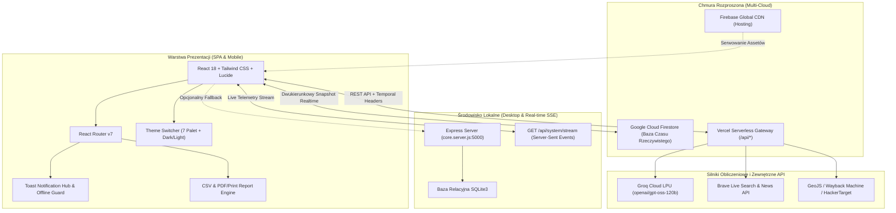
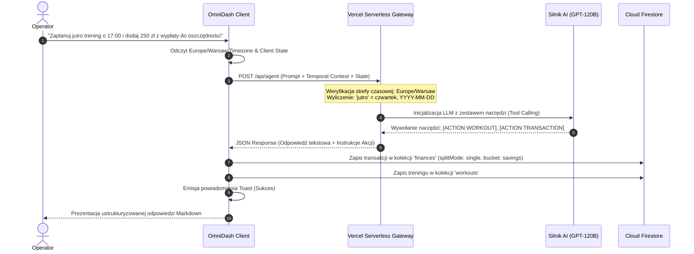

<div align="center">
  
# 🌌 OmniDash AI System Dashboard
### Zaawansowany Hybrydowy Hub Dowodzenia Napędzany Sztuczną Inteligencją

[](https://github.com/Kvbi213/ai-system-dashboard)
[](https://github.com/Kvbi213/ai-system-dashboard/actions)
[](https://github.com/Kvbi213/ai-system-dashboard)
[](https://testing-library.com/)
[](#)
[](#)
[](https://nodejs.org/)
[](LICENSE)

*Zunifikowany, wysoce zoptymalizowany ekosystem zarządzania osobistego i analityki operacyjnej z autonomicznym agentem AI, architekturą Cloud-First, pełną synchronizacją Firestore, telemetrią czasu rzeczywistego (SSE) oraz natywnym wsparciem strefy czasowej Europe/Warsaw.*

**[📑 Dokumentacja Architektury](ARCHITECTURE.md)** • **[📜 Rejestr Zmian](HISTORY.md)**

</div>

---

## 🖥️ Makieta Wizualna Interfejsu (Visual Layout Preview)

```
┌───────────────────────────────────────────────────────────────────────────────────────────────────────┐
│ 🌌 OmniDash AI Command Hub     [🔍 Szukaj Ctrl+K]   [☀/🌙 Motyw]   [Warszawa 14:32]   [● ONLINE]     │
├────────────────┬──────────────────────────────────────────────────────────────────────────────────────┤
│ 📊 Pulpit      │ ┌──────────────────────┐ ┌──────────────────────┐ ┌────────────────────────────────┐ │
│ 🤖 Asystent AI │ │ ● SSE LIVE STREAM    │ │ Open-Meteo Weather   │ │ ⚡ Wiadomości IT (Live Ticker) │ │
│ 🎓 Plan Lekcji │ │ CPU: 12%  RAM: 42%   │ │ 21°C  Słonecznie     │ │ [AI] GPT-120B reasoning update│ │
│ 💰 Finanse     │ │ Heap: 32MB Uptime: 4h│ │ Wiatr: 14 km/h       │ │ [Sec] Zero Trust Architecture│ │
│ 🏋 Treningi    │ └──────────────────────┘ └──────────────────────┘ └────────────────────────────────┘ │
│ 📅 Kalendarz   │ ┌──────────────────────────────────────────────────┐ ┌─────────────────────────────┐ │
│ 🧠 Pamięć AI   │ │ 💰 Budżet Kopertowy 50 / 30 / 20                 │ │ 📋 Lista Zadań (To-Do)      │ │
│ 🎯 OSINT Hub   │ │ Potrzeby: 50% | Zachcianki: 30% | Oszczędn.: 20% │ │ [x] Wdrożenie potoku CI/CD  │ │
│ 🖥 Serwer      │ │ Bilans: +1 420 PLN   [Eksport CSV] [Drukuj PDF]  │ │ [ ] Przegląd logów audytu   │ │
│ ────────────── │ └──────────────────────────────────────────────────┘ └─────────────────────────────┘ │
│ ⚙ Ustawienia   │ ┌──────────────────────────────────────────────────────────────────────────────────┐ │
│ 🌙 Tryb Ciemny │ │ 🤖 Autonomiczny Agent AI (Worker / Mentor) — Temporal Anchoring Europe/Warsaw    │ │
└────────────────┴─┴──────────────────────────────────────────────────────────────────────────────────┴─┘
```

---

## 📖 Spis Treści
1. [Wprowadzenie i Filozofia](#-wprowadzenie-i-filozofia)
2. [Architektura Systemu (Mermaid Diagrams)](#-architektura-systemu)
3. [Telemetria Czasu Rzeczywistego (SSE) & Motywy](#-telemetria-czasu-rzeczywistego-sse--motywy)
4. [Kluczowe Moduły i Funkcjonalności](#-kluczowe-moduły-i-funkcjonalności)
5. [Silnik Kognitywny AI i Temporal Anchoring](#-silnik-kognitywny-ai-i-temporal-anchoring)
6. [System Finansowy 50/30/20 & Eksport Raportów](#-system-finansowy-503020--eksport-raportów)
7. [Zmienne Środowiskowe (.env.example Breakdown)](#-zmienne-środowiskowe-envexample-breakdown)
8. [Automatyczne Testy Jednostkowe i Integracyjne (37/37)](#-automatyczne-testy-jednostkowe-i-integracyjne)
9. [Potok CI/CD (GitHub Actions)](#-potok-cicd-github-actions)
10. [Instalacja i Uruchomienie](#-instalacja-i-uruchomienie)
11. [Poradnik Rozwiązywania Problemów (Troubleshooting)](#-poradnik-rozwiązywania-problemów-troubleshooting)
12. [Stos Technologiczny i Licencja](#-stos-technologiczny)

---

## 💡 Wprowadzenie i Filozofia

**OmniDash** to platforma klasy **Enterprise Dashboard**, łącząca natychmiastową responsywność interfejsu (Glassmorphism / Tailwind CSS) z rozproszonym środowiskiem chmurowym (**Cloud-First Hybrid Mesh**).

Głównym założeniem projektu jest eliminacja tarcia w codziennym zarządzaniu czasem, budżetem, wiedzą i zadaniami. Zamiast izolowanych aplikacji, OmniDash dostarcza **pojedynczy, scentralizowany interfejs**, w którym autonomiczny model AI (`openai/gpt-oss-120b`) posiada bezpośrednie uprawnienia wykonawcze (**Autonomous Tool Calling**) do mutowania bazy danych, analizowania harmonogramów i pobierania danych OSINT w czasie rzeczywistym.

---

## 🏛️ Architektura Systemu

### 1. Hybrydowa Topologia Chmurowa (Cloud-First Hybrid Mesh)


```mermaid
graph TB
    subgraph Klient ["Warstwa Prezentacji (SPA & Mobile)"]
        UI["React 18 + Tailwind CSS + Lucide"]
        Router["React Router v7"]
        ToastHub["Toast Notification Hub & Offline Guard"]
        ExportHub["CSV & PDF/Print Report Engine"]
        ThemeEngine["Theme Switcher (7 Palet + Dark/Light)"]
    end

    subgraph Chmura ["Chmura Rozproszona (Multi-Cloud)"]
        FBHost["Firebase Global CDN (Hosting)"]
        Firestore["Google Cloud Firestore (Baza Czasu Rzeczywistego)"]
        VercelGW["Vercel Serverless Gateway (/api/*)"]
    end

    subgraph AI_Backends ["Silniki Obliczeniowe i Zewnętrzne API"]
        GroqCloud["Groq Cloud LPU (openai/gpt-oss-120b)"]
        BraveAPI["Brave Live Search & News API"]
        OSINT_APIs["GeoJS / Wayback Machine / HackerTarget"]
    end

    subgraph LocalHost ["Środowisko Lokalne (Desktop & Real-time SSE)"]
        Express["Express Server (core.server.js:5000)"]
        SSEStream["GET /api/system/stream (Server-Sent Events)"]
        SQLite["Baza Relacyjna SQLite3"]
    end

    UI --> Router
    Router --> ToastHub
    Router --> ExportHub
    UI --> ThemeEngine
    FBHost -.->|Serwowanie Assetów| UI
    UI <-->|Dwukierunkowy Snapshot Realtime| Firestore
    UI <-->|REST API + Temporal Headers| VercelGW
    UI <-->|Live Telemetry Stream| SSEStream
    VercelGW --> GroqCloud
    VercelGW --> BraveAPI
    VercelGW --> OSINT_APIs
    UI -.->|Opcjonalny Fallback| Express
    Express --> SQLite
```

### 2. Pętla Kognitywna Agenta AI z Kotwiczeniem Czasowym (Europe/Warsaw)


```mermaid
sequenceDiagram
    autonumber
    actor Operator as Operator
    participant Client as OmniDash Client
    participant Vercel as Vercel Serverless Gateway
    participant LLM as Silnik AI (GPT-120B)
    participant Cloud as Cloud Firestore

    Operator->>Client: "Zaplanuj jutro trening o 17:00 i dodaj 250 zł z wypłaty do oszczędności"
    Client->>Client: Odczyt Europe/Warsaw Timezone & Client State
    Client->>Vercel: POST /api/agent (Prompt + Temporal Context + State)
    Note over Vercel: Weryfikacja strefy czasowej: Europe/Warsaw<br/>Wyliczenie: 'jutro' = czwartek, YYYY-MM-DD
    Vercel->>LLM: Inicjalizacja LLM z zestawem narzędzi (Tool Calling)
    LLM-->>Vercel: Wywołanie narzędzi: [ACTION:WORKOUT], [ACTION:TRANSACTION]
    Vercel-->>Client: JSON Response (Odpowiedź tekstowa + Instrukcje Akcji)
    Client->>Cloud: Zapis transakcji w kolekcji 'finances' (splitMode: single, bucket: savings)
    Client->>Cloud: Zapis treningu w kolekcji 'workouts'
    Client->>Client: Emisja powiadomienia Toast (Sukces)
    Client-->>Operator: Prezentacja ustrukturyzowanej odpowiedzi Markdown
```

---

## ⚡ Telemetria Czasu Rzeczywistego (SSE) & Motywy

1. **Strumień Server-Sent Events (`/api/system/stream`)**:
   - Backend Express dostarcza nieprzerwany strumień telemetrii `text/event-stream` co 2 sekundy (użycie procesora, RAM, sterty V8, platformy oraz czasu bezawaryjnej pracy `uptime`).
   - Komponent `SystemMonitor.jsx` łączy się przez natywny `EventSource`. W przypadku braku backendu lub pracy w chmurze automatycznie przełącza się w bezkolizyjny tryb **Real-time Client Telemetry** (`window.performance`), wyświetlając stosowny indykator (`● SSE LIVE` vs `● CLIENT`).
   - Wbudowany stan szkieletowy (Skeleton Loader) oraz obsługa błędów z przyciskiem ponowienia (Retry).
2. **Zaawansowany Przełącznik Motywów (Dark / Light Toggle)**:
   - Natychmiastowy przycisk przełączania trybu jasnego i ciemnego z poziomu górnego paska mobilnego oraz stopki menu desktopowego.
   - Trwałość wyboru w `localStorage` (`system_theme`).
   - 7 predefiniowanych palet kolorystycznych: *Cyber Dark*, *Paper Light*, *Retro Amber*, *Monochrome*, *Matrix Green*, *Synthwave*, *Nordic Frost*.

---

## ✨ Kluczowe Moduły i Funkcjonalności

| Moduł | Ścieżka | Opis i Możliwości |
| :--- | :--- | :--- |
| **Pulpit Główny** | `/` | Monitor parametrów systemu w czasie rzeczywistym (SSE), widget pogody (Open-Meteo), pasek wiadomości IT, szybkie akcje. |
| **Inteligentny Czat** | `/chat` | Dwa autonomiczne tryby: **Worker** (operacyjny z prawem mutacji bazy) oraz **Mentor** (analityczny, chłodna dedukcja). Obsługa komend `/clear`, `/purge`, `/mode`, `/ping`. |
| **Zarządzanie Budżetem** | `/finances` | Pełny model kopertowy **50/30/20**, obsługa 0% alokacji, transfery między pulami, dynamiczne wykresy SVG, eksport CSV i raporty PDF. |
| **Plan Lekcji i Sal** | `/timetable` | Harmonogram zintegrowany z pamięcią przestrzenną AI (rozróżnianie budynków i sal z prefiksem `Z`, `SZ` oraz kropką `1.2`, `1.16`). |
| **Kalendarz Wydarzeń** | `/calendar` | Tworzenie, edycja i usuwanie wydarzeń z priorytetami, podglądem miesięcznym i przypomnieniami. |
| **Baza Pamięci AI** | `/memory` | Długoterminowy rejestr faktów o operatorze (`operator_brain`) z dynamicznym wstrzykiwaniem do promptu. |
| **Rozpoznanie OSINT** | `/osint` | Automatyczna klasyfikacja celów (IP, domena, adres MAC, e-mail) z integracją z GeoJS, Wayback Machine i HackerTarget. |
| **Dziennik Treningowy** | `/workouts` | Rejestr jednostek treningowych, czasów trwania i ćwiczeń ze statystykami. |
| **Terminal Systemowy** | `/server` | Konsola diagnostyczna, weryfikacja kluczy API, status procesów i połączeń sieciowych. |

---

## 🧠 Silnik Kognitywny AI i Temporal Anchoring

Jednym z kluczowych atutów OmniDash jest **bezwzględna precyzja czasowa**:
- **Temporal Context Injection**: Przy każdym zapytaniu do bramy API, klient generuje precyzyjny nagłówek czasowy w strefie `Europe/Warsaw` (godzina, minuta, data bezwzględna, polska i angielska nazwa dnia tygodnia).
- **Vercel Gateway Anchoring**: Nawet przy hostingu w klastrach globalnych (US/EU), brama Vercel (`api/agent.js`) wymusza strefę `Europe/Warsaw`, gwarantując, że asystent zawsze wie, jaki jest dzień tygodnia w Polsce i bezbłędnie oblicza pojęcia względne ("jutro", "za 3 dni", "w piątek rano").
- **Pamięć Przestrzenna**: Baza faktów w Firestore pamięta specyfikę infrastruktury (np. lokalizację odrębnych budynków szkolnych), dzięki czemu AI udziela kontekstowo trafnych wskazówek.

---

## 💰 System Finansowy 50/30/20 & Eksport Raportów

Moduł finansowy został zaprojektowany w oparciu o czysty, testowalny silnik matematyczny (`modules/services/budgetCalculator.js`):
- **Reguła 50/30/20 & Własne Wagi**: Standardowy podział na Potrzeby (50%), Zachcianki (30%) i Oszczędności (20%) z możliwością dowolnej modyfikacji (np. 70/0/30).
- **Dysponowanie Środkami**: Każdy wpływ może trafić do podziału automatycznego (`split`) lub bezpośrednio do wybranej koperty (`single`).
- **Transfery Między Kopertami**: Błyskawiczne przesuwanie nadwyżek (np. z *Zachcianek* do *Oszczędności*).
- **Centrum Eksportu Danych (`ExportModal.jsx` & `exportService.js`)**:
  - Pobieranie surowych danych w formacie **CSV** (zgodność z arkuszami Excel/Google Sheets, formatowanie RFC 4180).
  - Generowanie eleganckich, gotowych do druku lub zapisu w formacie **PDF** raportów ze stylizacją kaskadową (`@media print`).

---

## 🔐 Zmienne Środowiskowe (.env.example Breakdown)

| Zmienna | Wymagana | Domyślna Wartość | Opis i Źródło Klucza |
| :--- | :---: | :--- | :--- |
| `PORT` | Nie | `5000` | Port lokalnego serwera backendowego Express. |
| `NODE_ENV` | Nie | `development` | Tryb uruchomieniowy środowiska Node.js (`development` / `production`). |
| `GROQ_API_KEY` | **Tak** | `gsk_...` | Klucz API do modeli LPU Groq. Pobierz z [Groq Console](https://console.groq.com/). |
| `WEATHER_LAT` | Nie | `52.2297` | Szerokość geograficzna dla widżetu pogodowego (domyślnie Warszawa). |
| `WEATHER_LON` | Nie | `21.0122` | Długość geograficzna dla widżetu pogodowego (domyślnie Warszawa). |
| `BRAVE_SEARCH_API_KEY` | Opcjonalna | `BSA...` | Klucz wyszukiwarki Brave do wyszukiwania sieciowego na żywo ([Brave Search API](https://brave.com/search/api/)). |
| `PUSHBULLET_API_KEY` | Opcjonalna | `o.abc...` | Klucz do powiadomień Push na smartfon ([Pushbullet Settings](https://www.pushbullet.com/#settings)). |
| `DASHBOARD_PIN` | Nie | `1234` | 4-cyfrowy kod PIN blokady ekranu dashboardu. |
| `SESSION_SECRET` | Nie | `secret_...` | Sól kryptograficzna do sesji tokenów autoryzacyjnych. |
| `FIREBASE_PROJECT_ID` | Opcjonalna | `twoj-projekt` | Identyfikator projektu Google Firebase ([Firebase Console](https://console.firebase.google.com/)). |
| `VITE_FIREBASE_API_KEY` | Opcjonalna | `AIza...` | Klucz publiczny aplikacji webowej Firebase do autoryzacji Firestore. |
| `VITE_FIREBASE_PROJECT_ID` | Opcjonalna | `twoj-projekt` | Publiczny Project ID do inicjalizacji klienta Firestore w przeglądarce. |
| `VITE_FIREBASE_APP_ID` | Opcjonalna | `1:...` | Identyfikator aplikacji webowej Firebase. |

---

## 🧪 Automatyczne Testy Jednostkowe i Integracyjne

Projekt wyposażony jest w zautomatyzowany runner testów **Vitest** (`npm test`) zintegrowany ze środowiskiem **JSDOM** i biblioteką **@testing-library/react**:

```bash
# Uruchomienie pełnego zestawu testów (37 testów w 6 pakietach)
npm test

# Uruchomienie testów w trybie nasłuchiwania ciągłego (Watch)
npm run test:watch
```

### Zrealizowane Pakiety Testowe:
1. `tests/components.test.jsx` (**7 testów**) — weryfikacja renderowania komponentów Reacta, stanu szkieletowego, telemetrii czasu rzeczywistego w `SystemMonitor`, odporności `WeatherWidget` na awarie sieci, dynamicznego przełącznika motywów w `Sidebar` oraz aktywnego stosu powiadomień `ToastContainer` i modala `ExportModal`.
2. `tests/budget.test.js` (**13 testów**) — weryfikacja poprawności reguły 50/30/20, alokacji z wagami 0%, transferów, bilansu netto i cykli kopert.
3. `tests/time.test.js` (**6 testów**) — weryfikacja formatowania czasu w strefie `Europe/Warsaw`, przesunięć letnich (CEST) oraz nazw dni tygodnia.
4. `tests/osint.test.js` (**5 testów**) — weryfikacja precyzyjnej detekcji IPv4, adresów e-mail, domen wielopoziomowych i adresów MAC.
5. `tests/export.test.js` (**4 testy**) — sanityzacja znaków specjalnych, cudzysłowów i formatowanie RFC 4180 dla plików CSV.
6. `tests/cloudSync.test.js` (**2 testy**) — weryfikacja rejestru kolekcji Firestore i wykrywania środowiska.

**Wynik: 37/37 testów zdanych pomyślnie (100% PASS w ~3.5s).**

---

## 🔄 Potok CI/CD (GitHub Actions)

Projekt posiada dwa zunifikowane pliki potoków w katalogu `.github/workflows/`:
- `.github/workflows/main.yml` (Główny potok CI/CD produkcyjny)
- `.github/workflows/ci.yml` (Równoległy potok weryfikacyjny pull requestów)

Kroki potoku przy każdym `push` i `pull_request` do gałęzi `main`:
1. Pobranie repozytorium (`actions/checkout@v4`).
2. Przygotowanie środowiska Node.js 20.x (`actions/setup-node@v4` z cache npm).
3. Bezwzględna instalacja zależności ze spójnym lockfile (`npm ci`).
4. Uruchomienie zautomatyzowanego zestawu 37 testów jednostkowych i komponentowych (`npm test`).
5. Kompilacja produkcyjna pakietu Vite (`npm run build`).
6. Weryfikacja integralności artefaktów produkcyjnych (`test -f dist/index.html`).

---

## 🚀 Instalacja i Uruchomienie

### Wymagania Wstępne
- **Node.js** >= `20.0.0`
- **npm** >= `10.0.0`
- **Git**

### 1. Klonowanie i Instalacja Zależności
```bash
git clone https://github.com/Kvbi213/ai-system-dashboard.git
cd ai-system-dashboard
npm install
```

### 2. Konfiguracja Środowiskowa
Skopiuj plik `.env.example` do `.env`:
```bash
cp .env.example .env
```
Uzupełnij klucz `GROQ_API_KEY` (pobrany z [Groq Console](https://console.groq.com/)).

### 3. Uruchomienie Środowiska Deweloperskiego
```bash
# Uruchomienie klienta Vite i serwera Express równolegle
npm start

# Lub uruchomienie samego frontendu Vite (do pracy w chmurze)
npm run dev:client
```
Otwórz przeglądarkę pod adresem: `http://localhost:5173`.

### 4. Budowanie Produkcyjne
```bash
npm run build
```

---

## 🛠️ Poradnik Rozwiązywania Problemów (Troubleshooting)

### 1. Błąd zajętego portu 5000 (`EADDRINUSE: address already in use :::5000`)
- **Przyczyna:** Poprzednia instancja serwera Express nadal działa w tle.
- **Rozwiązanie:**
  - *Windows (PowerShell):* `Stop-Process -Id (Get-NetTCPConnection -LocalPort 5000).OwningProcess -Force`
  - *Linux / macOS:* `kill -9 $(lsof -t -i:5000)`
  - Alternatywnie: Zmień `PORT=5001` w pliku `.env`.

### 2. Czat AI zgłasza błąd klucza lub brak odpowiedzi
- **Przyczyna:** Brak `GROQ_API_KEY` w pliku `.env` lub przekroczony limit zapytań.
- **Rozwiązanie:** Zweryfikuj obecność klucza w `.env` i przeładuj serwer. W trybie chmurowym zweryfikuj zmienne środowiskowe w panelu Vercel (`Settings -> Environment Variables -> GROQ_API_KEY`).

### 3. Widżet Pogody pokazuje komunikat zastępczy
- **Przyczyna:** Blokada geolokalizacji w przeglądarce lub brak dostępu do sieci.
- **Rozwiązanie:** Komponent `WeatherWidget.jsx` posiada wbudowany odporny fallback: w przypadku zablokowania lokalizacji automatycznie pobiera dane pogodowe dla współrzędnych domyślnych (Warszawa). Kliknij ikonę odświeżenia lub zezwól na lokalizację w przeglądarce.

### 4. Praca w trybie offline (brak połączenia z internetem)
- **Działanie:** System automatycznie wykrywa zdarzenie `window.onoffline`. Baza Firestore buforuje zmiany lokalnie w pamięci podręcznej przeglądarki, a po odzyskaniu sygnału dokonuje automatycznej re-synchronizacji bez utraty danych.

---

## 🛠️ Stos Technologiczny

- **Warstwa Wizualna:** React 18, React Router v7, Tailwind CSS 3, Lucide React, i18next, React-Markdown.
- **Środowisko Testowe:** Vitest 2.x, @testing-library/react, JSDOM.
- **Baza i Chmura:** Firebase Hosting, Cloud Firestore (Realtime DB), Vercel Serverless Functions.
- **Silniki AI:** Groq LPU SDK (`openai/gpt-oss-120b`, `llama-3.3-70b-versatile`).
- **Narzędzia:** Vite 5, PostCSS, Autoprefixer, ESLint.

---

## 📄 Licencja

Projekt dystrybuowany na licencji **MIT**. Zobacz plik [LICENSE](LICENSE), aby dowiedzieć się więcej.
