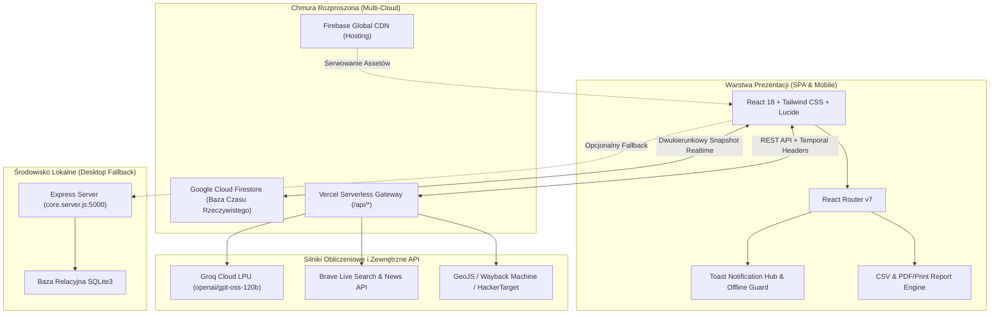
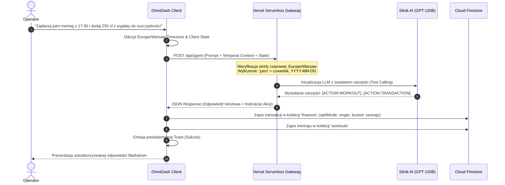

<div align="center">
  
# 🌌 OmniDash AI System Dashboard
### Zaawansowany Hybrydowy Hub Dowodzenia Napędzany Sztuczną Inteligencją

[](https://github.com/Kvbi213/ai-system-dashboard)
[](https://github.com/Kvbi213/ai-system-dashboard/actions)
[](https://github.com/Kvbi213/ai-system-dashboard)
[](#)
[](#)
[](https://nodejs.org/)
[](LICENSE)

*Zunifikowany, wysoce zoptymalizowany ekosystem zarządzania osobistego i analityki operacyjnej z autonomicznym agentem AI, architekturą Cloud-First, pełną synchronizacją Firestore oraz natywnym wsparciem strefy czasowej Europe/Warsaw.*

**[📑 Dokumentacja Architektury](ARCHITECTURE.md)** • **[📜 Rejestr Zmian](HISTORY.md)**

</div>

---

## 📖 Spis Treści
1. [Wprowadzenie i Filozofia](#-wprowadzenie-i-filozofia)
2. [Architektura Systemu (Mermaid Diagrams)](#-architektura-systemu)
3. [Kluczowe Moduły i Funkcjonalności](#-kluczowe-moduły-i-funkcjonalności)
4. [Silnik Kognitywny AI i Temporal Anchoring](#-silnik-kognitywny-ai-i-temporal-anchoring)
5. [System Finansowy 50/30/20 & Eksport Raportów](#-system-finansowy-503020--eksport-raportów)
6. [Centrum Powiadomień i Odporność Offline](#-centrum-powiadomień-i-odporność-offline)
7. [Automatyczne Testy Jednostkowe i Integracyjne](#-automatyczne-testy-jednostkowe-i-integracyjne)
8. [Potok CI/CD (GitHub Actions)](#-potok-cicd-github-actions)
9. [Instalacja i Uruchomienie](#-instalacja-i-uruchomienie)
10. [Stos Technologiczny](#-stos-technologiczny)

---

## 💡 Wprowadzenie i Filozofia

**OmniDash** to platforma klasy **Enterprise Dashboard**, łącząca natychmiastową responsywność interfejsu (Glassmorphism / Tailwind CSS) z rozproszonym środowiskiem chmurowym (**Cloud-First Hybrid Mesh**).

Głównym założeniem projektu jest eliminacja tarcia w codziennym zarządzaniu czasem, budżetem, wiedzą i zadaniami. Zamiast izolowanych aplikacji, OmniDash dostarcza **pojedynczy, scentralizowany interfejs**, w którym autonomiczny model AI (`openai/gpt-oss-120b`) posiada bezpośrednie uprawnienia wykonawcze (**Autonomous Tool Calling**) do mutowania bazy danych, analizowania harmonogramów i pobierania danych OSINT w czasie rzeczywistym.

---

## 🏛️ Architektura Systemu

### 1. Hybrydowa Topologia Chmurowa (Cloud-First Hybrid Mesh)


```mermaid
graph TB
    subgraph Klient ["Warstwa Prezentacji (SPA & Mobile)"]
        UI["React 18 + Tailwind CSS + Lucide"]
        Router["React Router v7"]
        ToastHub["Toast Notification Hub & Offline Guard"]
        ExportHub["CSV & PDF/Print Report Engine"]
    end

    subgraph Chmura ["Chmura Rozproszona (Multi-Cloud)"]
        FBHost["Firebase Global CDN (Hosting)"]
        Firestore["Google Cloud Firestore (Baza Czasu Rzeczywistego)"]
        VercelGW["Vercel Serverless Gateway (/api/*)"]
    end

    subgraph AI_Backends ["Silniki Obliczeniowe i Zewnętrzne API"]
        GroqCloud["Groq Cloud LPU (openai/gpt-oss-120b)"]
        BraveAPI["Brave Live Search & News API"]
        OSINT_APIs["GeoJS / Wayback Machine / HackerTarget"]
    end

    subgraph LocalHost ["Środowisko Lokalne (Desktop Fallback)"]
        Express["Express Server (core.server.js:5000)"]
        SQLite["Baza Relacyjna SQLite3"]
    end

    UI --> Router
    Router --> ToastHub
    Router --> ExportHub
    FBHost -.->|Serwowanie Assetów| UI
    UI <-->|Dwukierunkowy Snapshot Realtime| Firestore
    UI <-->|REST API + Temporal Headers| VercelGW
    VercelGW --> GroqCloud
    VercelGW --> BraveAPI
    VercelGW --> OSINT_APIs
    UI -.->|Opcjonalny Fallback| Express
    Express --> SQLite
```

### 2. Pętla Kognitywna Agenta AI z Kotwiczeniem Czasowym (Europe/Warsaw)


```mermaid
sequenceDiagram
    autonumber
    actor Operator as Operator
    participant Client as OmniDash Client
    participant Vercel as Vercel Serverless Gateway
    participant LLM as Silnik AI (GPT-120B)
    participant Cloud as Cloud Firestore

    Operator->>Client: "Zaplanuj jutro trening o 17:00 i dodaj 250 zł z wypłaty do oszczędności"
    Client->>Client: Odczyt Europe/Warsaw Timezone & Client State
    Client->>Vercel: POST /api/agent (Prompt + Temporal Context + State)
    Note over Vercel: Weryfikacja strefy czasowej: Europe/Warsaw<br/>Wyliczenie: 'jutro' = czwartek, YYYY-MM-DD
    Vercel->>LLM: Inicjalizacja LLM z zestawem narzędzi (Tool Calling)
    LLM-->>Vercel: Wywołanie narzędzi: [ACTION:WORKOUT], [ACTION:TRANSACTION]
    Vercel-->>Client: JSON Response (Odpowiedź tekstowa + Instrukcje Akcji)
    Client->>Cloud: Zapis transakcji w kolekcji 'finances' (splitMode: single, bucket: savings)
    Client->>Cloud: Zapis treningu w kolekcji 'workouts'
    Client->>Client: Emisja powiadomienia Toast (Sukces)
    Client-->>Operator: Prezentacja ustrukturyzowanej odpowiedzi Markdown
```

---

## ✨ Kluczowe Moduły i Funkcjonalności

| Moduł | Ścieżka | Opis i Możliwości |
| :--- | :--- | :--- |
| **Pulpit Główny** | `/` | Monitor parametrów systemu, widget pogody (Open-Meteo), pasek wiadomości IT, skróty operacyjne. |
| **Inteligentny Czat** | `/chat` | Dwa autonomiczne tryby: **Worker** (operacyjny z prawem mutacji bazy) oraz **Mentor** (analityczny, chłodna dedukcja). Obsługa komend `/clear`, `/purge`, `/mode`, `/ping`. |
| **Zarządzanie Budżetem** | `/finances` | Pełny model kopertowy **50/30/20**, obsługa 0% alokacji, transfery między pulami, dynamiczne wykresy SVG, eksport CSV i raporty PDF. |
| **Plan Lekcji i Sal** | `/timetable` | Harmonogram zintegrowany z pamięcią przestrzenną AI (rozróżnianie budynków i sal z prefiksem `Z`, `SZ` oraz kropką `1.2`, `1.16`). |
| **Kalendarz Wydarzeń** | `/calendar` | Tworzenie, edycja i usuwanie wydarzeń z priorytetami, podglądem miesięcznym i przypomnieniami. |
| **Baza Pamięci AI** | `/memory` | Długoterminowy rejestr faktów o operatorze (`operator_brain`) z dynamicznym wstrzykiwaniem do promptu. |
| **Rozpoznanie OSINT** | `/osint` | Automatyczna klasyfikacja celów (IP, domena, adres MAC, e-mail) z integracją z GeoJS, Wayback Machine i HackerTarget. |
| **Dziennik Treningowy** | `/workouts` | Rejestr jednostek treningowych, czasów trwania i ćwiczeń ze statystykami. |
| **Terminal Systemowy** | `/server` | Konsola diagnostyczna, weryfikacja kluczy API, status procesów i połączeń sieciowych. |

---

## 🧠 Silnik Kognitywny AI i Temporal Anchoring

Jednym z kluczowych atutów OmniDash jest **bezwzględna precyzja czasowa**:
- **Temporal Context Injection**: Przy każdym zapytaniu do bramy API, klient generuje precyzyjny nagłówek czasowy w strefie `Europe/Warsaw` (godzina, minuta, data bezwzględna, polska i angielska nazwa dnia tygodnia).
- **Vercel Gateway Anchoring**: Nawet przy hostingu w klastrach globalnych (US/EU), brama Vercel (`api/agent.js`) wymusza strefę `Europe/Warsaw`, gwarantując, że asystent zawsze wie, jaki jest dzień tygodnia w Polsce i bezbłędnie oblicza pojęcia względne ("jutro", "za 3 dni", "w piątek rano").
- **Pamięć Przestrzenna**: Baza faktów w Firestore pamięta specyfikę infrastruktury (np. lokalizację odrębnych budynków szkolnych), dzięki czemu AI udziela kontekstowo trafnych wskazówek.

---

## 💰 System Finansowy 50/30/20 & Eksport Raportów

Moduł finansowy został zaprojektowany w oparciu o czysty, testowalny silnik matematyczny (`modules/services/budgetCalculator.js`):
- **Reguła 50/30/20 & Własne Wagi**: Standardowy podział na Potrzeby (50%), Zachcianki (30%) i Oszczędności (20%) z możliwością dowolnej modyfikacji (np. 70/0/30).
- **Dysponowanie Środkami**: Każdy wpływ może trafić do podziału automatycznego (`split`) lub bezpośrednio do wybranej koperty (`single`).
- **Transfery Między Kopertami**: Błyskawiczne przesuwanie nadwyżek (np. z *Zachcianek* do *Oszczędności*).
- **Centrum Eksportu Danych (`ExportModal.jsx` & `exportService.js`)**:
  - Pobieranie surowych danych w formacie **CSV** (zgodność z arkuszami Excel/Google Sheets).
  - Generowanie eleganckich, gotowych do druku lub zapisu w formacie **PDF** raportów ze stylizacją kaskadową (`@media print`).

---

## 🔔 Centrum Powiadomień i Odporność Offline

- **Pływający Stos Toastów (`ToastContext` & `ToastContainer`)**: Wszystkie akcje asynchroniczne, mutacje danych, transfery i błędy sieciowe komunikowane są w spójnym, nienachalnym stylu Glassmorphism.
- **Detektor Połączenia Sieciowego**: Aplikacja nasłuchuje zdarzeń `online` oraz `offline`. W przypadku utraty zasięgu pojawia się elegancki pasek ostrzegawczy, a Cloud Firestore buforuje zmiany lokalnie w IndexedDB/LocalStorage.
- **Odporność na Błędy HTML/JSON**: Zaimplementowany globalny interceptor Axios blokuje błędy parsowania odpowiedzi serwerów przy braku backendu Node.js.

---

## 🧪 Automatyczne Testy Jednostkowe i Integracyjne

Projekt wyposażony jest w zautomatyzowany runner testów **Vitest** (`npm test`), gwarantujący bezwzględną poprawność kluczowej logiki biznesowej.

```bash
# Uruchomienie pełnego zestawu testów
npm test

# Uruchomienie testów w trybie nasłuchiwania (Watch)
npm run test:watch
```

### Zrealizowane Zestawy Testowe:
1. `tests/budget.test.js` (13 testów) — weryfikacja poprawności reguły 50/30/20, alokacji z wagami 0%, transferów, bilansu netto i cykli kopert.
2. `tests/osint.test.js` (5 testów) — weryfikacja precyzyjnej detekcji IPv4, adresów e-mail, domen wielopoziomowych i adresów MAC.
3. `tests/time.test.js` (6 testów) — weryfikacja formatowania czasu w strefie `Europe/Warsaw`, przesunięć letnich (CEST) oraz nazw dni tygodnia.
4. `tests/export.test.js` (4 testy) — sanityzacja znaków specjalnych, cudzysłowów i formatowanie RFC 4180 dla plików CSV.
5. `tests/cloudSync.test.js` (2 testy) — weryfikacja rejestru kolekcji Firestore i wykrywania środowiska.

**Wynik: 30/30 testów zdanych pomyślnie (100% PASS).**

---

## 🔄 Potok CI/CD (GitHub Actions)

Plik konfiguracyjny `.github/workflows/ci.yml` automatycznie uruchamia potok jakości przy każdym `push` i `pull_request` do gałęzi `main`:
1. Pobranie repozytorium (`actions/checkout@v4`).
2. Przygotowanie środowiska Node.js 20.x (`actions/setup-node@v4`).
3. Instalacja zależności (`npm ci`).
4. Wykonanie zautomatyzowanych testów (`npm test`).
5. Kompilacja produkcyjna (`npm run build`).
6. Weryfikacja artefaktów produkcyjnych (`dist/index.html`).

---

## 🚀 Instalacja i Uruchomienie

### Wymagania Wstępne
- **Node.js** >= `20.0.0`
- **npm** >= `10.0.0`
- **Git**

### 1. Klonowanie i Instalacja Zależności
```bash
git clone https://github.com/Kvbi213/ai-system-dashboard.git
cd ai-system-dashboard
npm install
```

### 2. Konfiguracja Środowiskowa
Skopiuj plik `.env.example` do `.env`:
```bash
cp .env.example .env
```
Uzupełnij klucze API (np. `GROQ_API_KEY`, `BRAVE_API_KEY`) według instrukcji w pliku.

### 3. Uruchomienie Środowiska Deweloperskiego
```bash
# Uruchomienie klienta i serwera równolegle
npm start

# Lub uruchomienie samego klienta Vite (dla pracy z chmurą Vercel/Firebase)
npm run dev:client
```
Otwórz przeglądarkę pod adresem: `http://localhost:5173`.

### 4. Budowanie Produkcyjne
```bash
npm run build
```

---

## 🛠️ Stos Technologiczny

- **Frontend:** React 18, React Router v7, Tailwind CSS 3, Lucide Icons, i18next, React-Markdown.
- **Silnik Testowy:** Vitest 2.x, Node.js Native Test Assertions.
- **Baza i Hosting Chmurowy:** Firebase Hosting, Cloud Firestore (Realtime DB), Vercel Serverless Functions.
- **Modele Językowe:** Groq SDK (`openai/gpt-oss-120b`, `llama-3.3-70b-versatile`).
- **Narzędzia Budowania:** Vite 5, PostCSS, Autoprefixer, ESLint.

---

## 📄 Licencja

Projekt dystrybuowany na licencji **MIT**. Zobacz plik [LICENSE](LICENSE), aby dowiedzieć się więcej.
